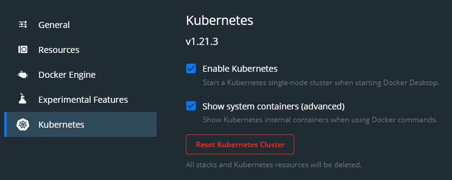
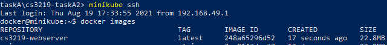

# cs3219-taskA2

## **Task A2: Introduction to Kubernetes**
This repository contains the files needed for CS3219 OTOT Task A2. 

In this task, I have learnt to set up kubernetes as well as integrate docker with it. Similar to Task A1, the docker application will run a simple web server with the landing page in nginx-html/index.html.

The kubernetes service set up in this case either **Kubernetes: docker for desktop** or **minikube**, as such the following steps will also be using that of **docker for desktop** followed by **minikube**.

--- 
#### How to deploy:

1. Ensure that you have Kubernetes and Docker installed in your machine. Kubernetes will run via **kubectl**.  
&nbsp;
2. Either download the files via the Git GUI, or by the following command
  
        git clone https://github.com/kormingsoon/cs3219-taskA2.git

3. Ensure that the Docker Desktop Enables Kubernetes.

&nbsp;
4. Run the following commands to build and verify that the image is created.
        
        docker build -t cs3219-nginx-image .
        docker images

5. Run the following commands to run Kubernetes. The second command will allow you to check that the pods are running successfully.

        kubectl apply -f .\cs3219-nginx-deployment.yaml
        kubectl get pods  -o wide

6. Finally, run the last command to allow the docker application to be accessible by a service rendered on Kubernetes.

        kubectl apply -f .\cs3219-nginx-svc.yaml

7. To view that the docker image is successfully deployed, check the following link.     

 http://localhost:32407 
  

---  
#### How to deploy with Minikube:
1. Run minikube
   
        minikube docker-env start
   
2. Build the image
   
        docker build -t cs3219-nginx-image .

3. Verifying that the image **cs3219-nginx-image** is inside.
   In the following image, the cs3219-webserver is the equivalent of **cs3219-nginx-image**.
   
        
        minikube ssh
        docker images

4. Run the following commands to run Kubernetes. The second command will allow you to check that the pods are running successfully.

        kubectl apply -f .\cs3219-nginx-deployment.yaml
        kubectl get pods  -o wide

5. Run the following to allow the Kubernetes to be accessible from localhost.
        
        minikube tunnel

6. Finally, run the last command to allow the docker application to be accessible by a service rendered on Kubernetes.
        
        kubectl apply -f .\cs3219-minikube-svc.yaml

7.  To view that the docker image is successfully deployed, check the following link.     

 http://localhost 
  

